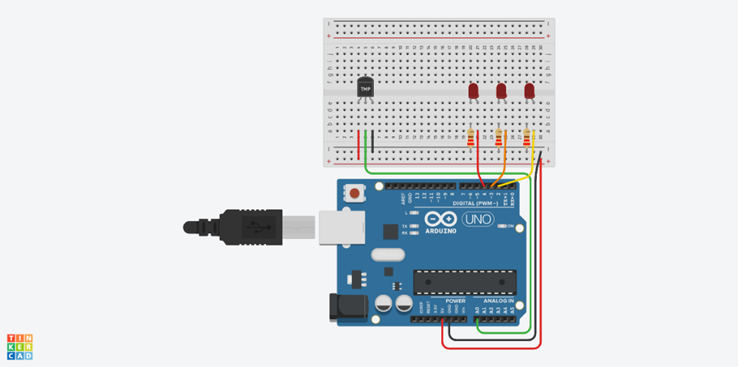
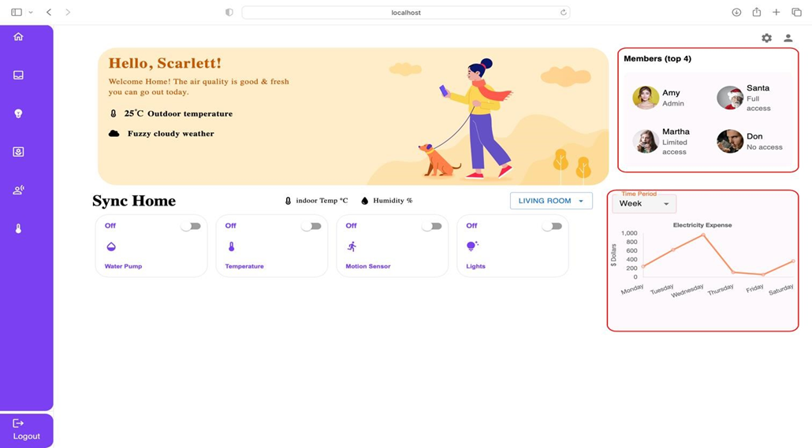
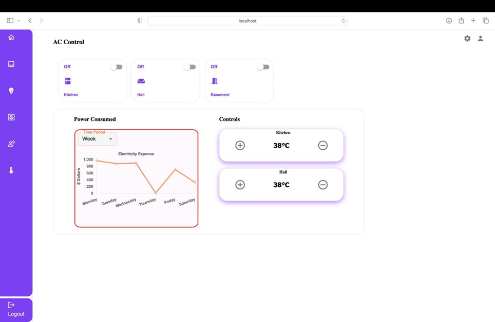
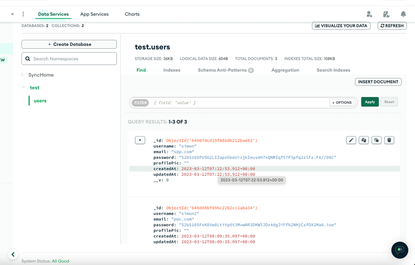
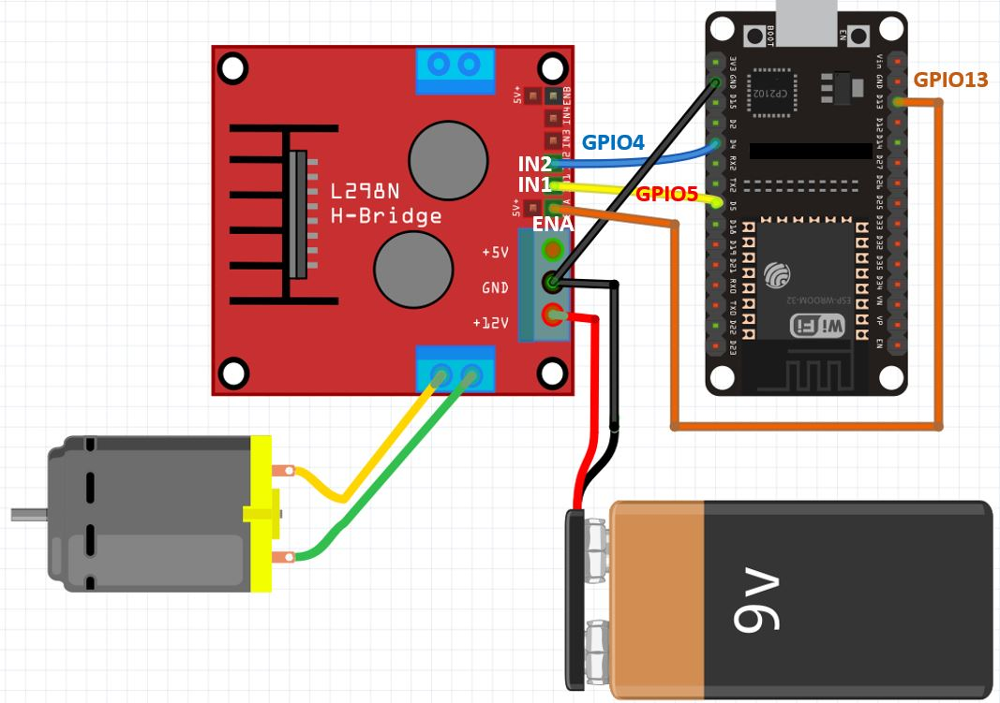
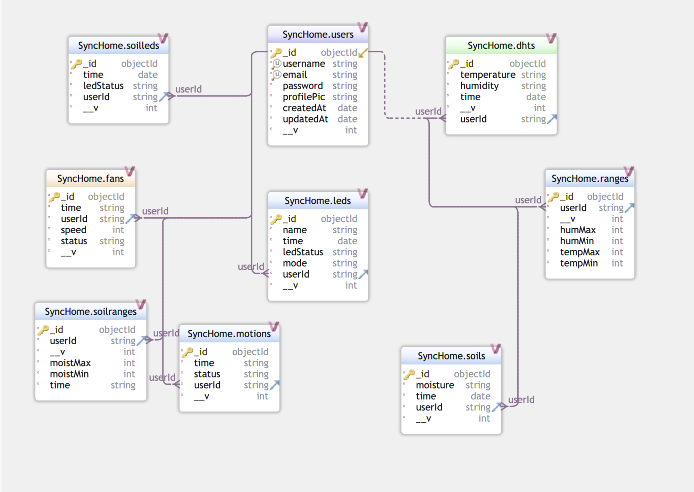
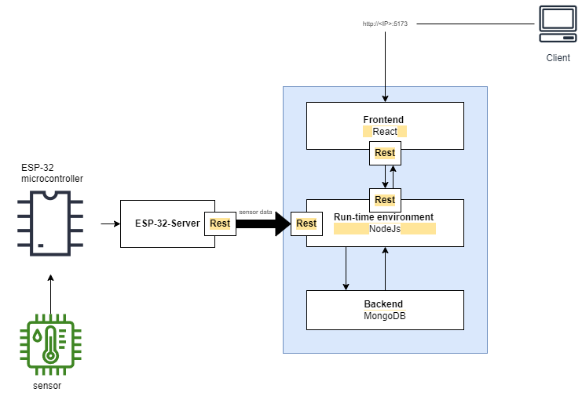

<html><head><meta content="text/html; charset=UTF-8" http-equiv="content-type"></head><body class="c21 doc-content">
&nbsp;

<h1 class="c43 c54" id="h.9cs7q8y1iy9h">CSIS 4495 - Applied Research Project</h1>
&nbsp; &nbsp; &nbsp; &nbsp; &nbsp; &nbsp; &nbsp; &nbsp; &nbsp; &nbsp; &nbsp; &nbsp; &nbsp; &nbsp; &nbsp; &nbsp; &nbsp; &nbsp; &nbsp; &nbsp; &nbsp; &nbsp; Winter 2023

Instructor - Stephen Chiong

Created By:-

<ul class="c22 lst-kix_npv38phdk9ij-0 start"><li class="c34 c11 li-bullet-0">Prathmesh Gujar </li><li class="c11 c34 li-bullet-0">Simon Chauke </li><li class="c34 c11 li-bullet-0">Ashish Gujral </li></ul>

<h1 class="c1" id="h.ic20dr7g1us2">Table of Contents</h1>

<a class="c9" href="#h.9cs7q8y1iy9h">CSIS 4495 - Applied Research Project&nbsp;&nbsp;&nbsp;&nbsp;&nbsp;&nbsp;&nbsp;&nbsp;0</a>

<a class="c9" href="#h.ic20dr7g1us2">Table of Contents&nbsp;&nbsp;&nbsp;&nbsp;&nbsp;&nbsp;&nbsp;&nbsp;1</a>

<a class="c9" href="#h.kmvn6wvrrdum">Statement of problem&nbsp;&nbsp;&nbsp;&nbsp;&nbsp;&nbsp;&nbsp;&nbsp;2</a>

<a class="c9" href="#h.f33vmgbt3prr">Significance of Study&nbsp;&nbsp;&nbsp;&nbsp;&nbsp;&nbsp;&nbsp;&nbsp;2</a>

<a class="c9" href="#h.hrl86idkvx6s">Project Implementation&nbsp;&nbsp;&nbsp;&nbsp;&nbsp;&nbsp;&nbsp;&nbsp;3</a>

<a class="c9" href="#h.3fnfa1i9fdqa">Objectives&nbsp;&nbsp;&nbsp;&nbsp;&nbsp;&nbsp;&nbsp;&nbsp;3</a>

<a class="c9" href="#h.gksvaso8e4ui">Proof of Progress&nbsp;&nbsp;&nbsp;&nbsp;&nbsp;&nbsp;&nbsp;&nbsp;3</a>

<a class="c9" href="#h.rz2phpqms0dq">Project Setup&nbsp;&nbsp;&nbsp;&nbsp;&nbsp;&nbsp;&nbsp;&nbsp;6</a>

<a class="c9" href="#h.ycxrqia3rx9y">Circuit Design&nbsp;&nbsp;&nbsp;&nbsp;&nbsp;&nbsp;&nbsp;&nbsp;6</a>

<a class="c9" href="#h.k1eqbj4fib54">Firmware Setup&nbsp;&nbsp;&nbsp;&nbsp;&nbsp;&nbsp;&nbsp;&nbsp;7</a>

<a class="c9" href="#h.y9xfqxxtu4wq">Web-app Setup&nbsp;&nbsp;&nbsp;&nbsp;&nbsp;&nbsp;&nbsp;&nbsp;8</a>

<a class="c9" href="#h.you9v1n0kpi1">Software Design Architecture&nbsp;&nbsp;&nbsp;&nbsp;&nbsp;&nbsp;&nbsp;&nbsp;9</a>

<a class="c9" href="#h.qbb06cafbzuj">Testing&nbsp;&nbsp;&nbsp;&nbsp;&nbsp;&nbsp;&nbsp;&nbsp;11</a>

<a class="c9" href="#h.2v1gre111if5">Project Setup on another machine&nbsp;&nbsp;&nbsp;&nbsp;&nbsp;&nbsp;&nbsp;&nbsp;12</a>

<a class="c9" href="#h.rpa1wi880sv">Takeaways/Conclusion&nbsp;&nbsp;&nbsp;&nbsp;&nbsp;&nbsp;&nbsp;&nbsp;12</a>

<a class="c9" href="#h.tysi6px11izt">Workload Distribution&nbsp;&nbsp;&nbsp;&nbsp;&nbsp;&nbsp;&nbsp;&nbsp;12</a>

<a class="c9" href="#h.9v8me9akxwwd">Citations&nbsp;&nbsp;&nbsp;&nbsp;&nbsp;&nbsp;&nbsp;&nbsp;13</a>

<a class="c9" href="#h.pyn10wtbukqv">Appendix A&nbsp;&nbsp;&nbsp;&nbsp;&nbsp;&nbsp;&nbsp;&nbsp;14</a>

<a class="c9" href="#h.m0j48c38avqu">Appendix B&nbsp;&nbsp;&nbsp;&nbsp;&nbsp;&nbsp;&nbsp;&nbsp;17</a>

<a class="c9" href="#h.dvehwtm0d0o2">Appendix C&nbsp;&nbsp;&nbsp;&nbsp;&nbsp;&nbsp;&nbsp;&nbsp;29</a>

<h1 class="c1" id="h.kmvn6wvrrdum">Statement of problem</h1>
We live in a world where things like house chores, security assurance, and even making coffee can be done by smart home devices. Our project delivers such solutions to the world that make it a more convenient place and help people focus on more important things by saving time.

However, from the tech perspective, smart home app development may be a challenging task:
<ul class="c22 lst-kix_utzrcd6wjgik-0 start"><li class="c42 c15 c11 c44 li-bullet-0">Choosing data protocol BLE, Wi-Fi or another protocol?</li><li class="c42 c15 c11 c44 li-bullet-0">How to connect several devices within one application?</li><li class="c42 c15 c11 c44 li-bullet-0">Possibility of 3rd-party services integration like Google Home or Alexa?</li></ul>
Our team designed and developed the home automation system using the ESP-32 microcontroller, various electronic components, and a web-app that connected to the ESP-32 microcontroller via wifi. The developed system automated lights, temperature monitoring and fan control, soil moisture monitoring and irrigation control, and movement monitoring.
<h1 class="c1" id="h.f33vmgbt3prr">Significance of Study</h1>
The &ldquo;SyncHome&rdquo; research project is significant for several reasons:

<ol class="c22 lst-kix_2wdqvxk4mb1i-0 start" start="1"><li class="c5 c11 li-bullet-0">Affordable and Customizable Solution: The developed home automation system provides an affordable and customizable solution for homeowners to automate their homes.</li><li class="c5 c11 li-bullet-0">Energy and Water Conservation: The system enables homeowners to monitor and control their energy and water consumption, leading to energy and water conservation.</li><li class="c5 c11 li-bullet-0">Increased Convenience: The home automation system provides increased convenience to homeowners by allowing them to control their home appliances remotely through the web-app.</li><li class="c5 c11 li-bullet-0">Contribution to the Field: The project contributes to the field of home automation by providing a low-cost and customizable solution that can be easily replicated and adapted to meet individual needs.</li></ol>

<h1 class="c1" id="h.hrl86idkvx6s">Project Implementation</h1><h2 class="c42 c15 c43" id="h.3fnfa1i9fdqa">Objectives</h2>
The main objectives of this project were as follows:

<ol class="c22 lst-kix_p0z3v8qt8f1p-0 start" start="1"><li class="c5 c11 li-bullet-0">To design and develop an affordable and customizable home automation system using ESP-32 microcontroller.</li><li class="c5 c11 li-bullet-0">To automate lights, temperature monitoring and fan control, soil moisture monitoring and irrigation control, and movement monitoring.</li><li class="c5 c11 li-bullet-0">To create a user-friendly web-app for easy access and control of the home automation system.</li><li class="c5 c11 li-bullet-0">To evaluate the effectiveness and efficiency of the developed home automation system.</li></ol><h2 class="c20" id="h.gksvaso8e4ui">Proof of Progress</h2>
Our team has made significant progress toward achieving its objectives. The following features/modules have been developed and implemented:

<ol class="c22 lst-kix_xgboiubib0zb-0 start" start="1"><li class="c5 c11 li-bullet-0">ESP-32 microcontroller and Electronics components: The team has successfully designed and assembled the hardware system using ESP-32 microcontroller and various electronics components to automate lights, temperature monitoring and fan control, soil moisture monitoring and irrigation control, and movement monitoring. This module addresses objective 1.</li></ol>

Figure 1: Modelling LED&rsquo;s circuit using TinkerCad. 

<ol class="c22 lst-kix_xgboiubib0zb-0" start="2"><li class="c5 c11 li-bullet-0">Web-App: The team has developed a full-stack web-app for easy access and control of the home automation system using MERN. The web-app allows users to register and login to access the automation controls. The web-app includes a dashboard with principal sensor control switches. The extended sensor controls and stats can be accessed by navigating to the specific sensor pages. This module addresses objective 3.</li></ol>

Figure 2: Web-app dashboard early prototype.

Figure 3: Temperature monitoring and AC control page.

<ol class="c22 lst-kix_xgboiubib0zb-0" start="3"><li class="c5 c11 li-bullet-0">REST API: The team has developed and implemented REST API to enable easy and efficient communication between the web-app and the ESP-32 microcontroller. The REST API allows the web-app to send and receive data from the ESP-32 microcontroller in a predefined format. This module addresses objective 2.</li></ol>

<ol class="c22 lst-kix_xgboiubib0zb-0" start="4"><li class="c5 c11 li-bullet-0">Sensor Data Collection: The team has developed and implemented sensor data collection modules to collect data from various sensors connected to the ESP-32 microcontroller, such as temperature sensors, humidity sensors, and light sensors. The collected data is formatted as JSON and sent back to the web-app using REST API, which stores it in the MongoDB Cloud Atlas. This module addresses objective 2.</li></ol>

Figure 4: User collection saved in MongoDB cloud.
<h1 class="c1 c27" id="h.sc89ssltad1"></h1><h1 class="c1" id="h.rz2phpqms0dq">Project Setup</h1><h2 class="c20" id="h.ycxrqia3rx9y">Circuit Design</h2>
Early circuits were designed using TinkerCAD. The circuit design is shown in the diagram below: 

Figure 5: Circuit Design for the DC Motor.

<h2 class="c20" id="h.k1eqbj4fib54">Firmware Setup</h2>
It is critical to get familiar with the working and implementation of each electronics/ hardware component before assembling and programming. The team used the following firmware in the project:

<ol class="c22 lst-kix_kfyyimud1m5n-0 start" start="1"><li class="c5 c11 li-bullet-0">ESP-32 microcontroller: The ESP-32 is a microcontroller that can be used as a web server to connect with web apps and send sensor data using REST API via wifi.</li><li class="c5 c11 li-bullet-0">DHT22 sensor: The DHT22 is a basic, low-cost digital temperature and humidity sensor. It uses a capacitive humidity sensor and a thermistor to measure the surrounding air&rsquo;s humidity and temperature.</li><li class="c5 c11 li-bullet-0">DC Motor: DC Motor or direct current motor is an electrical machine that transforms electrical energy into mechanical energy by creating a magnetic field that is powered by direct current. A DC motor is controlled using L298N Motor Driver. The direction and speed of a DC motor is determined by how we provide power to it.</li><li class="c5 c11 li-bullet-0">LED: A light-emitting diode (LED) is a semiconductor device that emits light when current flows through it. Electrons in the semiconductor recombine with electron holes, releasing energy in the form of photons.</li><li class="c5 c11 li-bullet-0">PIR Motion Sensor: The working principle of this sensor is based on the change of the infrared radiation on the moving object. If an object is emitting the infrared ray but not moving, it is NOT detected by the sensor. If an object is moving but not emitting the infrared ray, it is NOT detected by the sensor. Animals and humans emit infrared rays naturally. Therefore, the animals and humans can be detected by the sensor if they are moving.</li><li class="c5 c11 li-bullet-0">Resistive Soil Moisture Sensor: A resistive soil moisture sensor works by using the relationship between electrical resistance and water content to gauge the moisture levels of the soil. You&rsquo;ll observe these sensors to possess two exposed probes that are inserted directly into the soil sample.</li></ol>

To set up the Firmware, follow the circuit design provided in the above section. Connect ESP-32 to your computer using micro-usb data transfer cable. Clone the Arduino Sketch from github: https://github.com/prathmesh300346562/synchome.git&nbsp;

, then edit the wifi name and password fields in the code to allow wifi access, finally, use Arduino-IDE to upload the Sketch to ESP-32. You will see the notifications showing IP address upon successful execution of Sketch.

Firmware setup is completed, electronic components are ready to use.
<h2 class="c20" id="h.y9xfqxxtu4wq">Web-app Setup</h2>
The ESP-32 web server needs to be set up separately and connected to the local network for the SyncHome web app to communicate with it. Please refer to the Firmware section for setup instructions.

In order to run this application locally, you must have node installed on your computer. To check if you already have it installed, enter node -v&nbsp;in your terminal.

Once you have confirmed that node is installed, cd&nbsp;into a folder on your computer and run the following command to clone the repository:
<table class="c40"><tr class="c36"><td class="c37" colspan="1" rowspan="1">
git clone&nbsp;https://github.com/prathmesh300346562/synchome.git
</td></tr></table>

Then cd into the root folder and open it in your code editor. For Visual Studio Code:

&nbsp;cd&nbsp; synchome

Next, install all of the required dependencies for both the backend folder and the frontend folder. cd&nbsp;into the backendfolder and run npm install&nbsp;.

To run frontend execute npm run dev. This should build and run the frontend locally &nbsp;on <a class="c9" href="https://www.google.com/url?q=http://localhost:5173/&amp;sa=D&amp;source=editors&amp;ust=1688333078539600&amp;usg=AOvVaw1zO1AnLALhRkBmljwl99oX">http://localhost:5173/</a>.

Then return to the backend folder and run&nbsp;npm install&nbsp;again. Execute npm start&nbsp;to run the backend. This should start the app&rsquo;s server. We are not using any env variables to keep things simple. The server should connect to database with confirmation shown in the console.

You should see a login/register screen with form. Register to create a new account. Login with your newly created account to see the dashboard with welcome message and control switches. 
<h1 class="c1" id="h.you9v1n0kpi1">Software Design Architecture</h1>
The software design architecture of the SyncHome web-app and ESP-32 web server can be explained as follows:

The front-end of the SyncHome web-app is built using React, a JavaScript library for building user interfaces. The React components render the web-app&#39;s UI and handle user interactions such as registering, logging-in and controlling home automation. The front-end components communicate with the back-end through REST API calls.

The back-end of the SyncHome web-app is built using Node.js and Express.js. The Express.js middleware handles incoming REST API requests from the front-end and communicates with the MongoDB database to retrieve and store data. The back-end also communicates with the ESP-32 web server through REST API calls to control home automation.

The SyncHome web-app uses MongoDB, a NoSQL database, to store user data, home automation settings, and sensor data. MongoDB provides a flexible and scalable solution to store and retrieve data efficiently.

Insert uml diagram here 

The ESP-32 microcontroller acts as a web server and is responsible for receiving REST API requests from the SyncHome web-app, controlling the electronics components, and sending sensor data back to the web-app. The ESP-32 web server is programmed using Arduino IDE and uses the ESP-32&#39;s built-in wifi module to communicate with the web-app.

The SyncHome web-app and ESP-32 web server communicate with each other using REST API calls. The web-app sends REST API requests to the back-end to retrieve and store data, while the ESP-32 web server sends REST API requests to the back-end to control home automation settings and send sensor data.

Overall, the SyncHome web-app and ESP-32 web server software design architecture leverage the MERN stack to create a scalable, efficient, and user-friendly home automation solution. The front-end, back-end, database, and ESP-32 web server work together to enable home automation, store and retrieve data, and provide a seamless user experience.

Figure: Software Architecture Design for the project.
<h1 class="c1" id="h.qbb06cafbzuj">Testing</h1>
The software testing phase is critical to ensure that the web-app and ESP-32 web server function as expected. The testing was done manually by the team members. The software testing process for the SyncHome project included Integration tests, Functional tests, and Performance testing. The testing process ensured that the SyncHome project worked correctly and met the project objectives. All tests passed successfully, indicating that the SyncHome project is ready for real world application.

Integration tests were performed to test the interaction between the various components of the SyncHome project. The integration tests covered the interaction between the front-end, back-end, database, and ESP-32 web server. We have used state lifting techniques in Reactjs such as Context API to preserve and share the App states on all pages. The integration tests ensured that the components could communicate with each other correctly, and the data was transferred without errors. 

Functional tests were performed to test the individual functions of the SyncHome web-app and ESP-32 web server. The functional tests included testing the registration and login functionality, controlling home automation using API&rsquo;s, and retrieving sensor data. The functional tests ensured that the SyncHome project&#39;s features worked correctly.

Performance testing was performed to test the SyncHome project&#39;s ability to handle a large number of sensor data. The performance testing included testing the web-app&#39;s response time, ESP-32 web server&#39;s ability to handle sensor data, and the database&#39;s ability to store and retrieve data efficiently. Using multiple sensors together was creating time delay during runtime. To solve this issue, we have incorporated parallel programming in ESP-32 for lag free execution. The performance testing ensured that the SyncHome project could handle a high volume of sensor data and met the project objectives. 

Unfortunately, the SyncHome project did not involve survey testing therefore we don&#39;t have feedback from users to evaluate the usability, user experience, and overall satisfaction of a product or service. However, this should not affect our project as its primary focus is on functionality rather than usability.

Moreover, testing performed by the team members might introduce bias into the testing process. To mitigate such bias, the team tried to involve external testers whenever possible to provide additional perspectives and feedback. However, it is essential to acknowledge that bias due to testing performed by the team members might still exist to some extent.
<h1 class="c0" id="h.2v1gre111if5">Project Setup on another machine</h1>
&nbsp;

The process of Project setup on another machine is similar to the last section. Therefore, &nbsp;follow the instructions in the previous section.

<h1 class="c1" id="h.rpa1wi880sv">Takeaways/Conclusion</h1>
Smart home software development is a complex process and requires patience and teamwork so that everything functions seamlessly. 

This Research Project challenged us to expand our knowledge beyond the technologies learnt during our academic career as we explored tools such as arduino esp-32 microcontroller and electronics circuit design. It served as an excellent opportunity to break out of our comfort zone to develop skills such as:
<ul class="c22 lst-kix_mtr55qdh03i7-0 start"><li class="c5 c11 li-bullet-0">Programming the ESP-32 microcontroller using Arduino IDE to implement the web server, REST API, and sensor data collection.</li><li class="c5 c11 li-bullet-0">Sourcing of electronic components.</li><li class="c5 c11 li-bullet-0">Working with UI libraries such as Material UI, and ChartJs. Working with backend libraries like node-fetch and multer.</li></ul>

<h1 class="c0" id="h.tysi6px11izt">Workload Distribution</h1>
Workload distribution was fair and equally distributed. 
<ul class="c22 lst-kix_mca5derzhg61-0 start"><li class="c29 c35 c11 li-bullet-0">Simon: Dashboard design, Frontend Development and API integration.</li><li class="c29 c11 c35 li-bullet-0">Ashish: Frontend Development and UI, Data visualisation, and App State Management.</li><li class="c29 c35 c11 li-bullet-0">Prathmesh: Circuit design and Research , ESP-32 programming, and Backend Development.</li></ul>

<h1 class="c1" id="h.9v8me9akxwwd">Citations</h1><ol class="c22 lst-kix_nkl9otczmhbc-0 start" start="1"><li class="c5 c11 li-bullet-0">Material-UI: https://mui.com/material-ui/getting-started/installation/</li><li class="c5 c11 li-bullet-0">ChartJS: https://www.chartjs.org/</li><li class="c5 c11 li-bullet-0">ESP-32: https://docs.espressif.com/projects/esp-idf/en/latest/esp32/get-started/index.html</li><li class="c5 c11 li-bullet-0">Arduino-IDE: https://www.arduino.cc/en/software</li><li class="c29 c35 c11 li-bullet-0">Context API and use Reducer: https://javascript.plainenglish.io/react-auth-hook-context-api-and-usereducer-8567a2ef0d89</li></ol>

&nbsp;

&nbsp;

&nbsp; &nbsp; &nbsp; &nbsp; &nbsp; &nbsp;

</body></html>